# User's Manual figures

_Captured from the default tenant at 1600x1000, 2x scale on 2026-09-16._

**Figure 1.** Part 1. The header: bank mark, tab strip, guided-tour selector, settings, and the Demo menu. In demonstration mode the DEMO MODE banner sits alongside them.

**Figure 2.** Part 2. My Work. My loans holds everything assigned to the officer; Available to claim holds the unassigned pool. Opening a loan from the pool claims it.

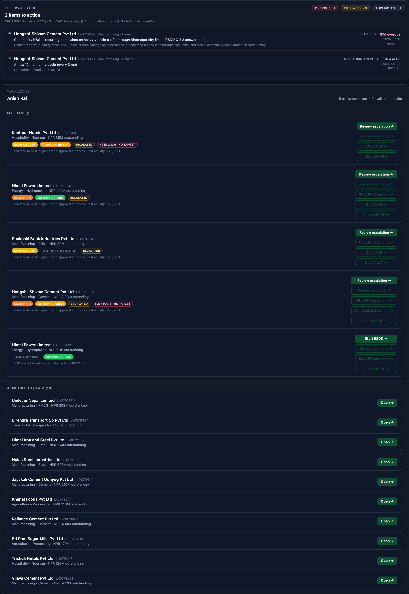

**Figure 3.** Part 2.3. Follow-ups due. Corrective actions and monitoring reports falling due in the next thirty days, bucketed overdue, this week, and this month.

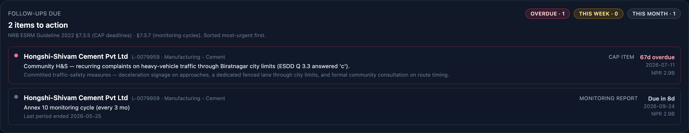

**Figure 4.** Part 3. Loan Book. The full portfolio with filtering by taxonomy colour, business unit, sector, and free text.

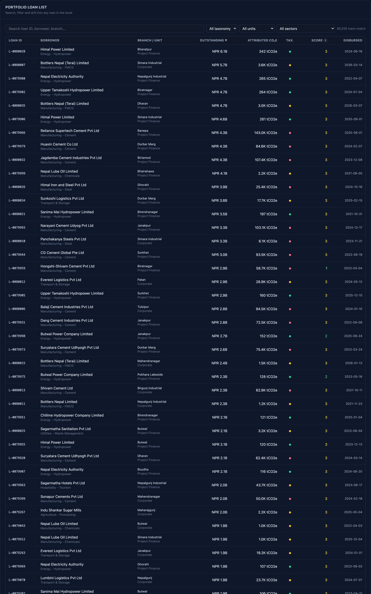

**Figure 5.** Part 4.2. The escalation banner. Every loan screened above Low risk, with the driving questions inline, raised automatically above the manager's queue.

**Figure 6.** Part 4.2. The overdue corrective actions banner. Portfolio-wide, and independent of which loan the manager is looking at.

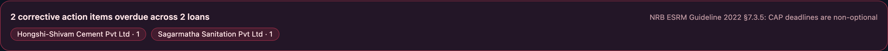

**Figure 7.** Part 4.4. The per-loan workbench. The compliance stripe summarises the loan; the sub-tabs beneath it hold every obligation attached to it.

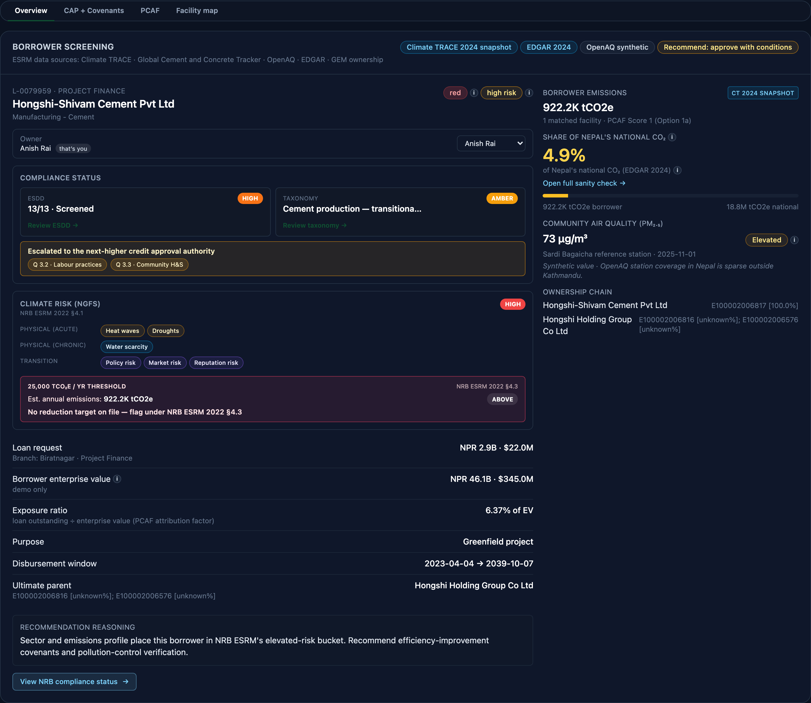

**Figure 8.** Part 5. The ESDD wizard. One Annex 5 question with NRB's four answer options, the guidance notes beneath it, the remarks field, and the evidence attachment panel.

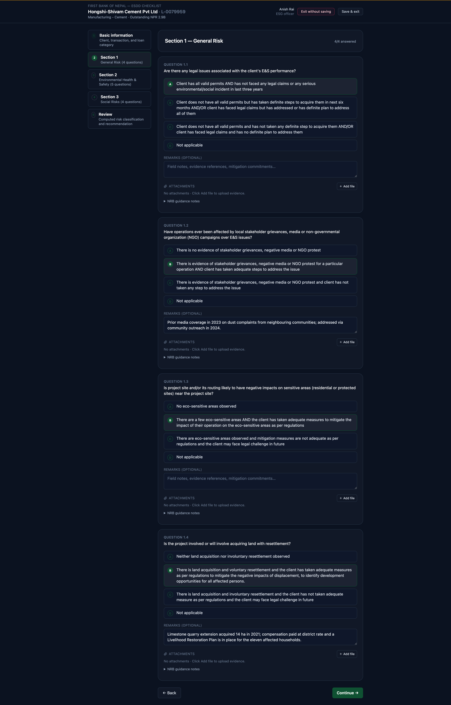

**Figure 9.** Part 6. The Green Finance Taxonomy wizard. Activity selection from the NRB 2024 catalogue, with Do No Significant Harm checks called out separately.

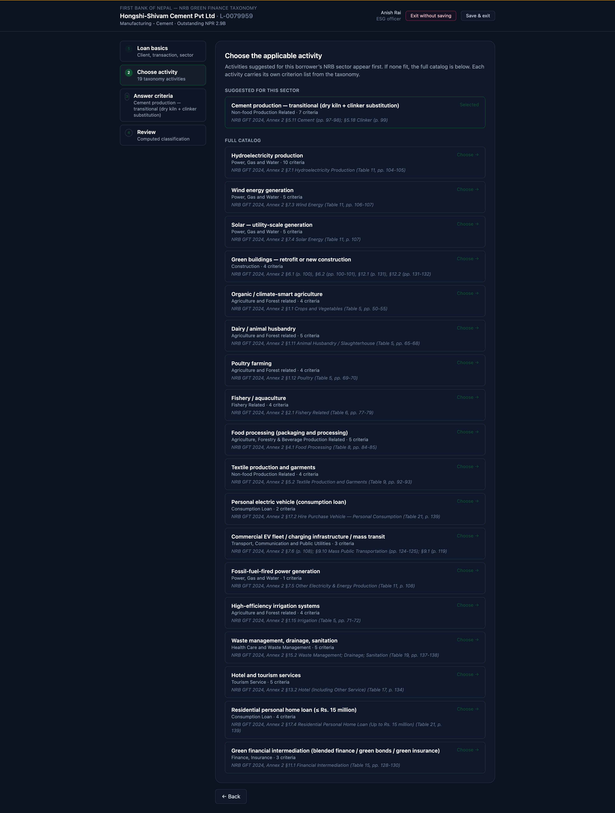

**Figure 10.** Part 7. Annex 5b project finance screening, mapped to the eight IFC Performance Standards. Shown only on project-finance loans.

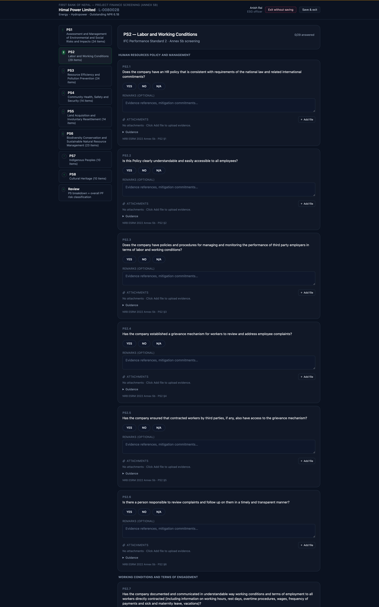

**Figure 11.** Part 8.2. The PCAF availability panel. Each flag records the answer (Exists or Does not exist) separately from its source (AUTO where the platform inferred it, MANUAL where an officer set it).

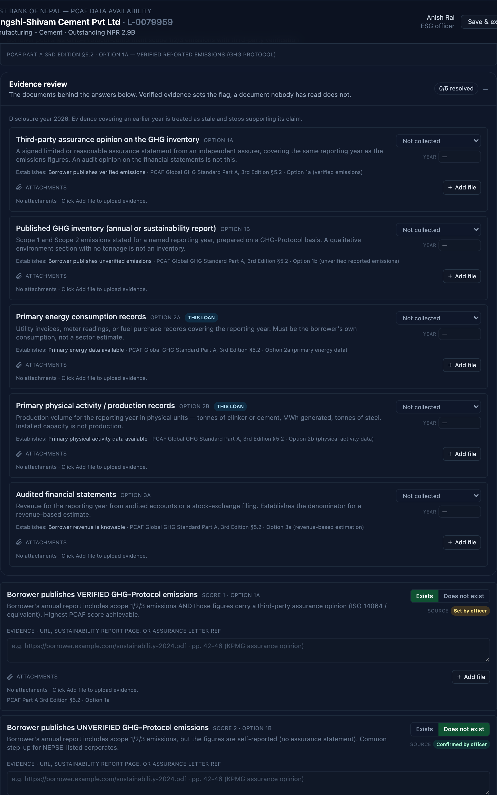

**Figure 12.** Part 9. The corrective action plan wizard at /cap/[loanId]: time-bound items with owners and deadlines, E&S covenants, and periodic monitoring under sections 7.3.5 and 7.3.7.

![Part 9. The corrective action plan wizard at /cap/[loanId]: time-bound items with owners and deadlines, E&S covenants, and periodic monitoring under sections 7.3.5 and 7.3.7.](12-cap-wizard.png)

**Figure 13.** Part 11. The disclosure surface. Total financed emissions, the disclosure year, the weighted PCAF data quality score, and in-scope exposure.

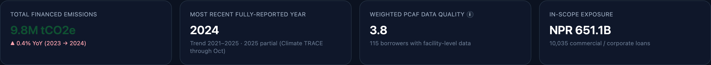

**Figure 14.** Part 11.3. The NRBSIS Annex 4b Green Finance Statement, generated from the portfolio in one click as bank-branded Excel, PDF, or JSON.

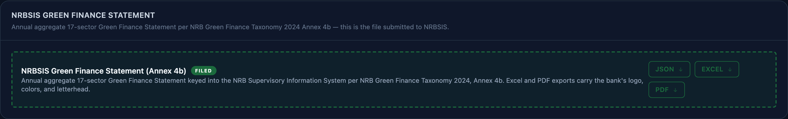
